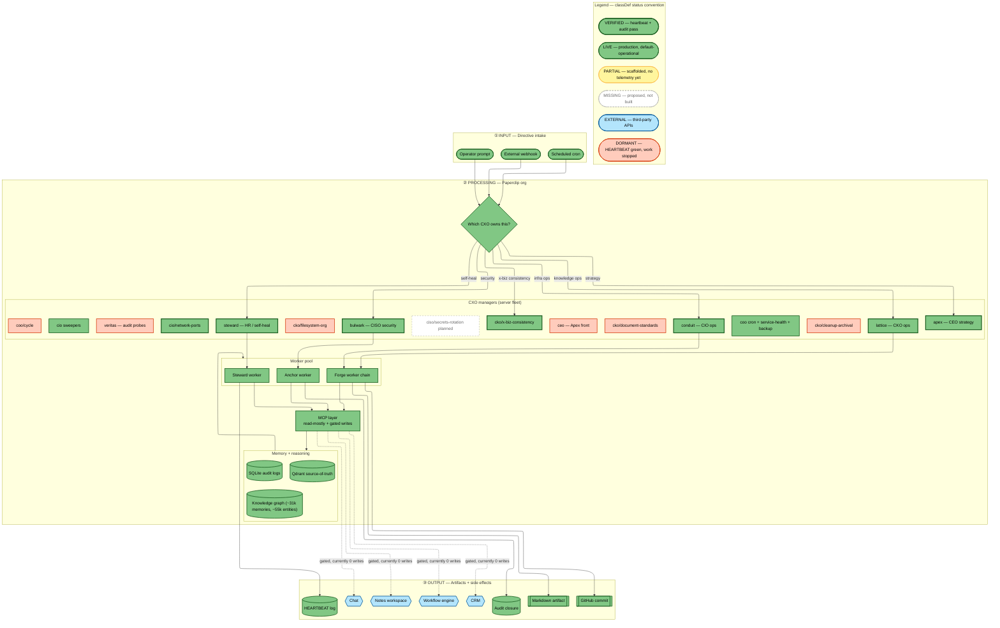

# Paperclip Architecture

Paperclip is an AI executive team that runs server-side and absorbs the manager-tier work of a solo, multi-business operator. One person cannot be CEO, operator, and CTO of four businesses at once — the bottleneck is the operator. Paperclip is the dispatch layer that takes a directive, decides which executive function owns it, and routes it to a worker pool backed by a shared memory layer. This document is a prose walkthrough of the system architecture diagram: first the status legend, then a lane-by-lane walk of the topology, then an honest accounting of what is actually verified today.

This repository is the public artifact for an applied-AI program capstone. The goal is to present Paperclip on its own merits and to be precise about what is built versus what is still ahead.

---

## The status legend

Every node in the diagram carries a status color. The colors are not decoration — they encode how much trust the node has earned, graded by an internal classifier rather than self-asserted. Six states are used:

- **VERIFIED** — the manager emits a healthy heartbeat *and* produces domain output that passes audit. This is the only state that means "actually doing the job." It is the bar the whole system is graded against.
- **LIVE** — a production component that is default-operational: infrastructure, workers, the memory stores, and the intake/output nodes that are simply running. LIVE means "wired and working," not "audited as doing executive work."
- **PARTIAL** — scaffolded and structurally present, but with no telemetry yet. The role exists; there is nothing to measure.
- **DORMANT** — the uncomfortable state. The heartbeat is green, so a naive health check would call it healthy, but the actual domain work has stopped. This is "process theatre": motion without output. Surfacing DORMANT honestly is the point of the grading instrument.
- **MISSING** — proposed but not yet built. It appears in the diagram so the intended shape is visible, drawn with a dashed outline.
- **EXTERNAL** — third-party APIs (CRM, workflow automation, knowledge base, chat). These are outside the org boundary; Paperclip integrates with them under a write gate.

The distinction that matters most is **VERIFIED vs DORMANT**. A heartbeat alone is cheap to fake — a process can tick forever while producing nothing useful. VERIFIED requires that the work itself passes inspection. The entire honest-status narrative below turns on refusing to count a green heartbeat as "working."

---

## Walking the three lanes

The diagram reads left-to-right, top-to-bottom, across three lanes: **INPUT → PROCESSING → OUTPUT**. A directive enters on the left, is owned and worked in the middle, and lands as an artifact or side effect on the right.

### Lane 1 — INPUT (directive intake)

Three intake sources can start a directive:

- **Operator prompt** — the human operator asks for something directly.
- **Scheduled cron** — a recurring routine fires on a timer (for example, periodic sweeps and health checks).
- **External webhook** — an outside event triggers work.

All three converge on a single decision point in the processing lane. The intake nodes are LIVE: they are plumbing, always running, not executive functions.

### Lane 2 — PROCESSING (the Paperclip org)

This is the body of the system. It has four parts: a router, the CXO managers, the worker pool, and the memory + MCP layers.

**The router** — the first node is a routing decision: *"Which CXO owns this?"* Every directive is classified into an executive lane before any work begins. The router is the spine of the topology: it sends knowledge operations to the knowledge lane, infrastructure operations to the infra lane, self-heal work to the people/health lane, security work to the security lane, and strategy to the executive lane. Routing is what lets a single intake stream fan out to specialized managers without the operator hand-assigning anything.

**The CXO managers (server fleet)** — these are the executive functions, identified by codename and by lane:

- **lattice — CKO ops** (knowledge): the chief-knowledge function. Owns knowledge operations and is the destination for the router's "knowledge ops" path. *Verified.*
- **conduit — CIO ops** (infrastructure): the chief-information/infrastructure function, destination for "infra ops." *Verified.*
- **steward — HR / self-heal** (people + recovery): owns self-healing and recovery routines, destination for "self-heal." *Verified.*
- **bulwark — CISO security** (security): the chief-security function, destination for "security." *Verified.*
- **apex — CEO strategy** (executive): the top-level strategy function, destination for "strategy." *Verified.*
- **cko/x-biz-consistency** — keeps standards consistent across the operator's businesses; destination for "x-biz consistency." *Verified.*
- **cio/network-ports** — an infrastructure manager that watches for port-binding drift. *Verified.*

Alongside the verified managers sit several that are scaffolded or DORMANT. Under the knowledge lane: **cko/cleanup-archival**, **cko/filesystem-org**, and **cko/document-standards**. Under the operations lane: **coo/cycle**. Under the executive lane: a **ceo — Apex front** and **veritas — audit probes** (the audit function). These carry the DORMANT marker — heartbeat present, domain output not yet flowing. Two operations managers, **cio sweepers** and **coo cron + service-health + backup**, are LIVE production routines. One lane, **ciso/secrets-rotation**, is PLANNED — on the roadmap, proposed in the design but not yet built (drawn dashed).

This split inside one subgraph is deliberate: the diagram does not pretend the whole fleet is working. The verified core is a minority of the managers, and the rest are shown honestly in their true state.

**The worker pool** — managers do not do the work themselves; they dispatch it to workers. The diagram shows three worker tracks, all LIVE:

- **Forge worker chain** — the general build/produce chain; receives work from lattice and conduit.
- **Anchor worker** — receives work from bulwark (security).
- **Steward worker** — receives work from steward (self-heal).

The manager-to-worker hand-off is the orchestration pattern at the heart of Paperclip: a manager decides *what* and *whether*, a worker does *how*. A single directive can therefore be decomposed across managers and worked in parallel by different workers.

**The MCP layer** — all three worker tracks funnel through one **MCP layer** described as *read-mostly + gated writes*. This is the controlled boundary between the org's reasoning and everything it can touch. It is LIVE. "Read-mostly" is a design stance: by default the system reads context freely and writes sparingly, and any write that leaves the org boundary passes a gate (see Production safety below).

**The memory + reasoning layer** — the MCP layer reads from and writes to three persistent stores, all LIVE:

- **Knowledge graph** (~31k memories, ~55k entities) — the multi-hop reasoning substrate; used when a question requires tracing relationships, not just similarity.
- **Qdrant source-of-truth** — the curated vector store of canonical facts. When scattered documents disagree with this store, the source-of-truth store wins by default.
- **SQLite audit logs** — the durable record of what happened: decisions, gate outcomes, and closures.

Memory feeds back into the worker pool: workers retrieve context from memory, reason over it, and only then act. The flow is *read context → reason → respond → write* — workers are never asked to act cold.

### Lane 3 — OUTPUT (artifacts + side effects)

Work lands on the right as concrete outputs. Internal artifacts (all LIVE) are:

- **Markdown artifact** and **GitHub commit** — produced by the Forge chain. These are the primary deliverables: documents written, code committed.
- **Audit closure** — produced by the Anchor worker; a finding worked to resolution.
- **HEARTBEAT log** — produced by the Steward worker; the liveness signal.

Then there are the **external systems** — a **CRM**, a **workflow engine**, a **notes workspace**, and a **chat platform** — marked EXTERNAL. Critically, the MCP layer reaches them over a **dashed edge labeled "gated, currently 0 writes."** The integrations are wired and reachable, but no write to any external system has occurred. The path exists; the gate is holding it shut by design.

---

## Production safety: the write gate

Paperclip uses **human-in-the-loop approval gating keyed on the stakes and reversibility of each action**. Low-stakes, reversible actions — writing a heartbeat, producing a markdown draft — auto-execute. High-stakes or irreversible actions — anything that writes to an external system of record — require an explicit approval token before they fire.

This is exactly what the dashed "currently 0 writes" edge encodes. During the documented operating cycle, **zero external writes occurred: the gate held.** The external integrations being wired-but-silent is not an incomplete feature — it is the safety model working as intended. Nothing leaves the org boundary without authorization.

---

## The honest status: 7 → 11 verified after one flywheel cycle

The centerpiece of this capstone is not the org chart — it is the instrument that grades the org, and what happened when it was run honestly.

Before shipping the executive team, the operator built the thing that scores it: a classifier that sorts every manager into VERIFIED / PARTIAL / STUB / DORMANT. Running it produced an uncomfortable baseline. Of roughly **30 managers, only 7 were VERIFIED** — actually doing domain work. The other **23 (about 77%) were process-only**: heartbeats green, no domain output. That is a 23% verified rate. Most of the "team" was process theatre.

Rather than hide that number, the capstone ships the fix. The mechanic is a **flywheel cycle**:

> **audit → select findings → fix via a multi-agent orchestration → re-audit**

One cycle was run as an overnight pass: a multi-agent orchestration of roughly **36 agents (managers plus workers)** took the audit findings, selected which to act on, and worked the fixes. Then the same classifier re-graded the fleet. The result:

- **Verified managers went from 7 to 11** — a move from **23% to 37% verified** in a single cycle.
- **+4 managers transitioned** into the verified state.
- **0 regressed** — nothing that was working broke.
- **5 of 6 findings were accepted**; **1 needs revision.**

This is the generalizable intellectual property: an **audit-as-eval pattern** wrapped in a **trace → evaluate → fix → re-evaluate** loop, supported by an evaluation harness with explicit failure modes, a small set of graded cases, a judge rubric, and a before/after comparison. The same loop applies regardless of which business the underlying workflow serves — it is the orchestration topology and the honest grading discipline that are the product, not any single vertical's workflow.

### What is NOT built yet

Precision about gaps is part of the posture:

- **Judge calibration** — formal true-positive / true-negative rate thresholds for the grading judges are not yet shipped.
- **The 19 remaining process-only managers** — many are scaffolded with no domain workload yet; they show as PARTIAL or DORMANT honestly.
- **One business intentionally has zero managers** — a holding-company line in the operator's portfolio is deliberately unmanaged, not a gap.
- **Full distributed tracing is a later phase** — today's observability feeds the evaluation harness; it is not yet the harness itself.
- **No automated regression check after each manager fix yet** — the "0 regressed" result above was confirmed by re-audit, not by an automatic per-fix guard.

The honest read: a verified executive core exists and is growing through a repeatable, measured flywheel; the external write path is wired but gated shut at zero writes; and the remaining managers are shown in their true state rather than dressed up. The system is built to make "actually working" the only thing that counts as working.

---

## The diagram

